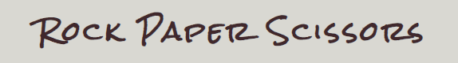

# HandGame

[Veiw the project here](https://linushf.github.io/HandGame/)

## Table of contents
* [General info & Purpose](#general-info)
* [User Stories](#user-stories)
* [Features](#features)
* [Technologies](#technologies)
* [Testing](#testing)
* [Credit](#credit)

## General info

The purpose of this site is to create an easy and well-coded game in JavaScript. The HTML and CSS are easy to read and understand. The game itself is a widely known hand game called "Rock, paper, Scissors". The game is very easy to understand, you pick one hand sign of rock paper or scissors and show your opponent at the same time. Rock beats scissors, scissors beat paper, and paper beats rock.

Socially this game can be used to decide who will make dinner in a "best out of 5" or just easily see who has their lucky day. 

This page is a milestone project to become a Full Stack Developer. The course is provided by [Code Inistitute](https://codeinstitute.net/).

## User Stories

As a player, I want to access the game easily so this game is created as a one-Click game with a scoreboard. I want the game to be recognizable and easy to understand. 

- __Balsamiq__
    - In the start-up/planning process I used Balsamiq to create wireframes

## Features
The features on this page are coded in a way so the user can access all features without navigating away from the game. 
### Existing Features

- __Header__

    The header is only containing the title of the game and has a contrast that is making it easy to read. 

    
- __Landing Page__

    The landing page is the main game page. Easy access and ready to play. The page has a lot of interactive features such as a reset button that is displayed when the game is initialized, a scoreboard that shows who is in the lead, a text that explains who won the round, and a "Rules ?" - text that will display a textbox that explains the basic rules. 
    

- __Game Options__

    The page shows all three hand signs that are required for gameplay. User clicks on the icon that represents their choice. and a text is explaining whos has won that round. The text will be blue if the user won and red if the computer has won. 

    

- __Score__

    The scoreboard is counting the current score and the avatar symbol helps the user to identify with the score belongs to who. To make it clear the computer avatar is red colored and the user avatar light blue. When the game is initialized a reset button appears and when clicked the user will be asked "Are you sure?" if the answer is "yes" the game will be reset to 0:0 and the result text will change to "Let's see if you can beat him this time!". The reset button is now hidden but reappears whenever a new game is initialized. If the user answers "no" to the "are you sure?"-question the game will continue without any changes. 

    

### Future Features

- __Highscore board__
    To add more value to the user it would be cool to add a high score list. In that case, the user could submit their name and post/submit to the high scoreboard.

- __Multiplayer__
    To make the players able to challenge their family, friends, and colleagues. 

- __Other hand games__
    There are many games like this and in the future, it could be an idea to add some more hand games to this page.

## Technologies
- __Languages__
    - HTML5
    - CSS3
    - JavaScript
- __Framework, Libaries & Programs Used__
    - Git
    - Github
    - Font Awesome
    - Google Fonts
    - Adobe Color
    - Balsamiq

## Testing
- __Validator__
    - HTML - WC3 - no errors were returned when passing through the official W3C Validator.

    

    - CSS - Jigsaw - no errors were returned when passing through the official (jigsaw) Validator.

    

    - JSHint - the code passed through the code analysis tool JSHint with no significant issues. 17 warnings that are not relevant for this project.

    

    - Accessibility - I generated a report in devtool lighthouse to make sure that colors and fonts are easy to read and accessible.
    
    
    

- __Browsers__
    - I have tested that this page works, with no errors, when using different web browsers such as Safari, Chrome, Firefox, and Edge. 
- __Responsiveness__ 
    - I have confirmed that the design is responsive and all functions work on different screen sizes. 

## Credit
- __Code__
    - To create a functional and good-looking site I tried to create a basic and easy-to-read HTML and CSS code.
    - In the start-up process I watched a tutorial on [YouTube](https://www.youtube.com/watch?v=jaVNP3nIAv0 "YouTube Video") for inspiration. 
- __Content__
    - The rules that are displayed when hovering "rules"-text are copied from [a webpage](https://www.thegamegal.com/2016/02/18/rock-paper-scissors-instructions/ "Rules instruction") that explains the game very well.
- __Media__
    - Picture on top of this README is generated from. [Am I Responsive](http://ami.responsivedesign.is/)
    - Colors on this page is a set of colors that I found on [Adobe Colors](https://color.adobe.com/ "Adobe Colors") 
- __Acknowledgement__
    - Code institute tutor service has helped me a lot when I was facing issues with coding and design.
    - My mentor, Rohit Sharma, has been very helpful throughout the process of creating this project. 

Enjoy the game!
[See more of my work on GitHub](https://www.github.com/linushf)
